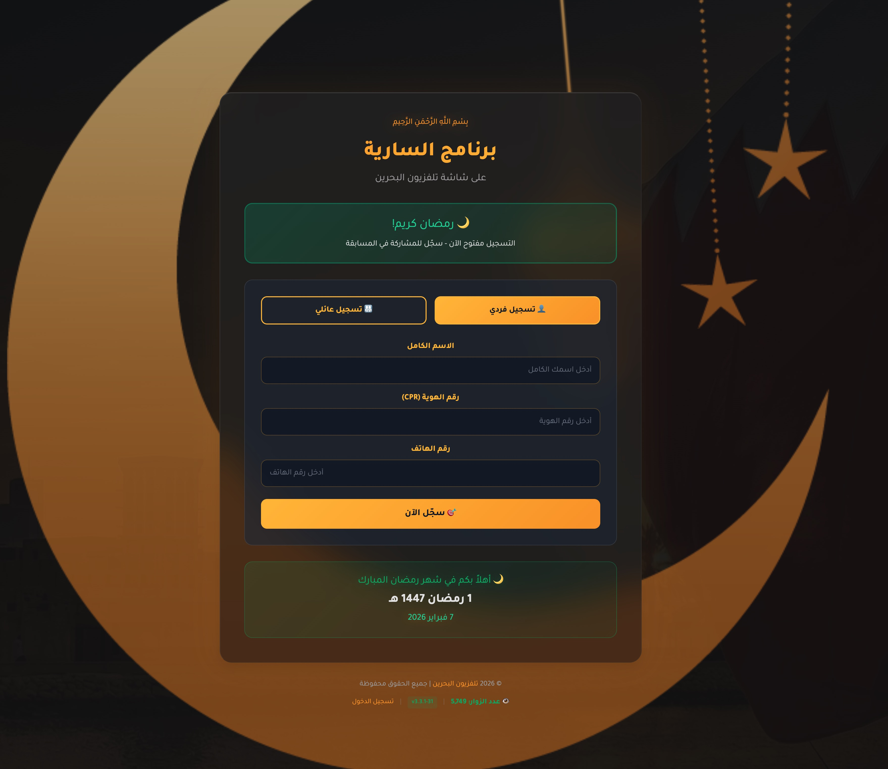

# برنامج السارية المباشر من تلفزيون البحرين

[](https://github.com/Bahrain-TV/alsaryatv/actions/workflows/ci.yml)

برنامج السارية المباشر من تلفزيون البحرين



## CHANGELOG

- 2025-01-16: تحديث البرنامج ليعمل مع النسخة الجديدة من السارية
- 2025-01-20: تصفير العدادات والتسجيل اليومي

...

- 2025-03-10: Final version

## النسخة الحالية

- v 5.1.0 - Daily Selected Names Email Feature (2026-02-19)
- v 3.7.0 - Synchronized version (2026-02-15)
- v 3.1.22233440

## الميزات الحديثة

### 🌟 البريد الإلكتروني اليومي للأسماء المختارة

إرسال تقرير بريدي يومي يحتوي على آخر 10 أسماء تم اختيارها من لوحة اختيار الفائز

- إرسال تلقائي يومياً الساعة 9:00 صباحاً (توقيت البحرين)
- تصميم مبهر مع رسوم متحركة
- مدعوم بتقنيات Qwen Code

You can force republish vendor files by executing an Artisan command. In a terminal, run:

```markdown
php artisan vendor:publish --force --tag=filament-views
```
<!-- NOTE: Future issues of this sort should be resolved using the enforcement command. Do not modify built-in templates. -->

To restore dark mode assets, run:

```markdown
php artisan vendor:publish --force --tag=filament-assets
```
<!-- NOTE: Never modify built-in templates directly. Use vendor:publish commands to enforce changes. -->

---

### تنفيذ وتصميم

- [حسن الدوي](https://www.linkedin.com/in/aldoyh/) - Agents Orchestration
- [Qwen Code](https://qwen.ai/) - Daily Selected Emails Feature
- [Claude Code](https://claude.ai/)
- [AI Assistant](https://openai.com)
