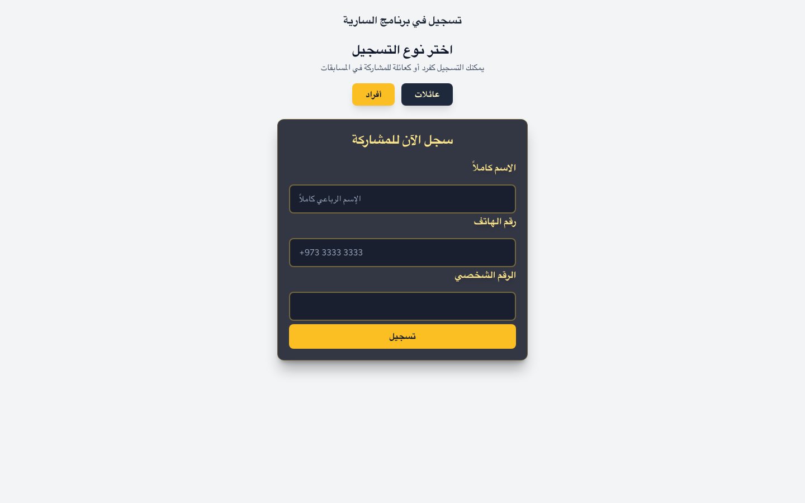
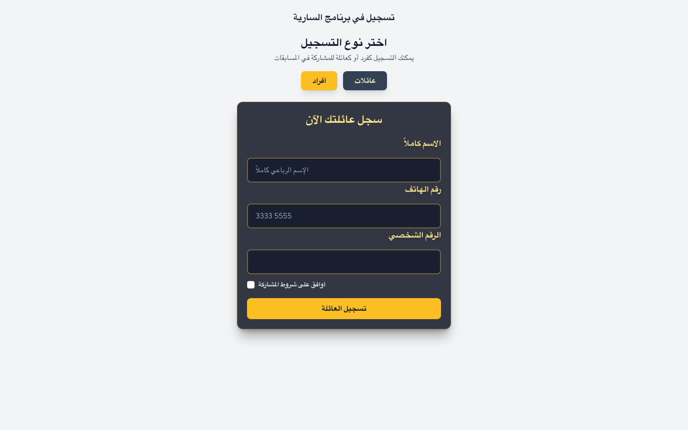

# AlSarya TV — Sponsor Screenshots for Slide Deck (Updated)

These slides show the updated sponsor layout where each sponsor has a text label to balance visual weight.

---

## Slide 1 — Splash / Home (Individual)
File: screenshots-3/01-home-individual-form.png

Suggested slide title: "Splash — Home (Individual Registration)"
Speaker notes: "Opening slide. Shows sponsor logos with labels: Jasmis (left) and Bapco Energies (right). Use this as the deck's sponsor acknowledgement/intro slide."

---

## Slide 2 — Sponsors Close-up
File: screenshots-3/01-home-sponsors-crop.png

Suggested slide title: "Sponsors — Jasmis & Bapco Energies (Close-up)"
Speaker notes: "Close-up of both sponsor logos with labels. Place sponsor names and short thanks text. Keep logos and labels prominent and centered."

---

## Slide 3 — Home (Family Registration)
File: screenshots-3/02-home-family-form.png

Suggested slide title: "Home — Family Registration View"
Speaker notes: "Shows family registration screen and sponsor placement with labels. Useful for showing how sponsors appear alongside forms."

---

## Slide 4 — Register Page (Individual)
File: screenshots-3/03-register-individual-form.png

Suggested slide title: "Register — Individual Form"
Speaker notes: "Individual registration page with sponsor visibility; use to illustrate user flow."

---

## Slide 5 — Register Page (Family)
File: screenshots-3/04-register-family-form.png

Suggested slide title: "Register — Family Form"
Speaker notes: "Family registration UI; sponsors remain visible with labels. Use this for UX slide."

---

## Slide 6 — Dashboard (Authenticated)
File: screenshots-3/05-dashboard.png

Suggested slide title: "Admin Dashboard Overview"
Speaker notes: "Authenticated dashboard screenshot. Sponsors/branding appear in the live view; use to show admin controls and context."

---

## Files included (relative to repository root)
- screenshots-3/01-home-individual-form.png
- screenshots-3/01-home-sponsors-crop.png
- screenshots-3/02-home-family-form.png
- screenshots-3/03-register-individual-form.png
- screenshots-3/04-register-family-form.png
- screenshots-3/05-dashboard.png

---

Notes for Google Gemini:
- Create one slide per image in the order above.
- Use the suggested slide titles and speaker notes to populate slide titles and notes.
- Ensure sponsor logos and labels are rendered clearly on the first two slides and include a "Sponsored by Jasmis & Bapco Energies" text block on the sponsor slide.

*Generated: screenshots_for_slides_updated.md*